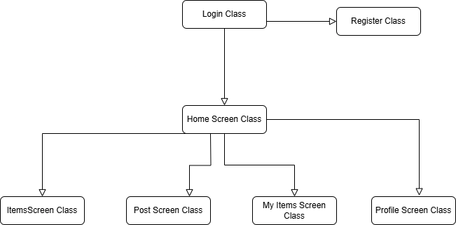
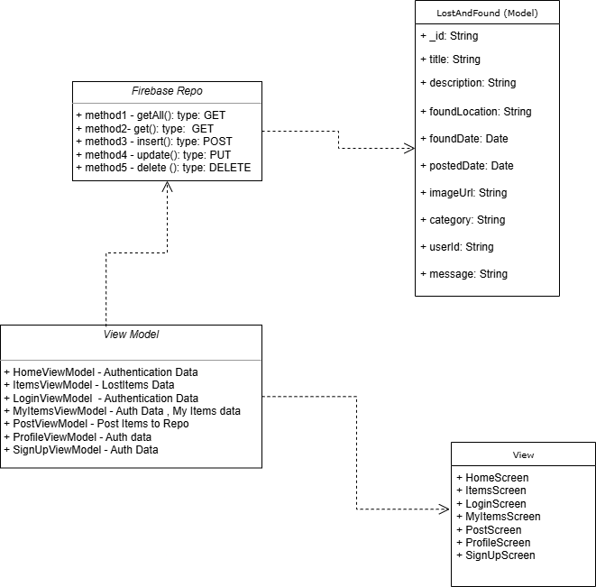

# Lost And Found App

This is a mobile app built using the MVVM architecture pattern. It uses Firebase as the backend for data storage and retrieval.

## 🧱 Project Structure

- `data/` – Firebase repository and data models
- `viewmodel/` – ViewModels that interact with the repositories
- `views/` – UI components (Activities/Fragments)

## 📦 Features

- MVVM architecture
- Firebase integration
- LiveData and ViewModel usage

## 🚀 Getting Started

1. Clone the repository:
   ```bash
   https://github.com/BijoSetu/lost_and_found.git


### MVVM Class Diagram



### UML  Diagram


